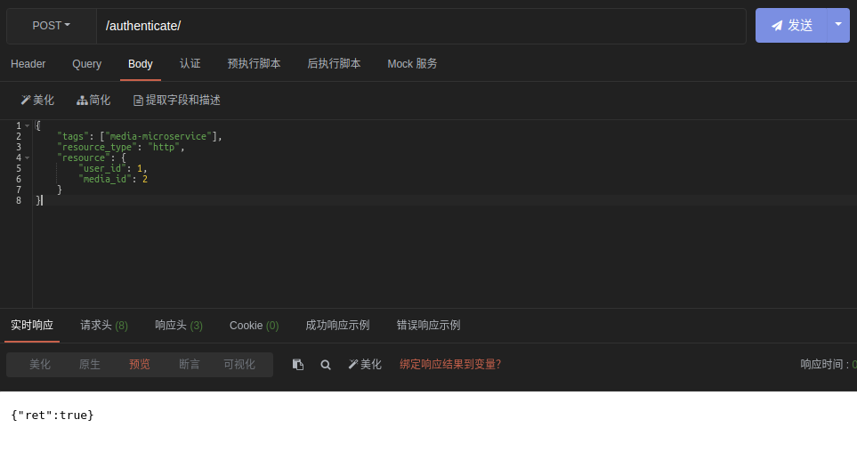
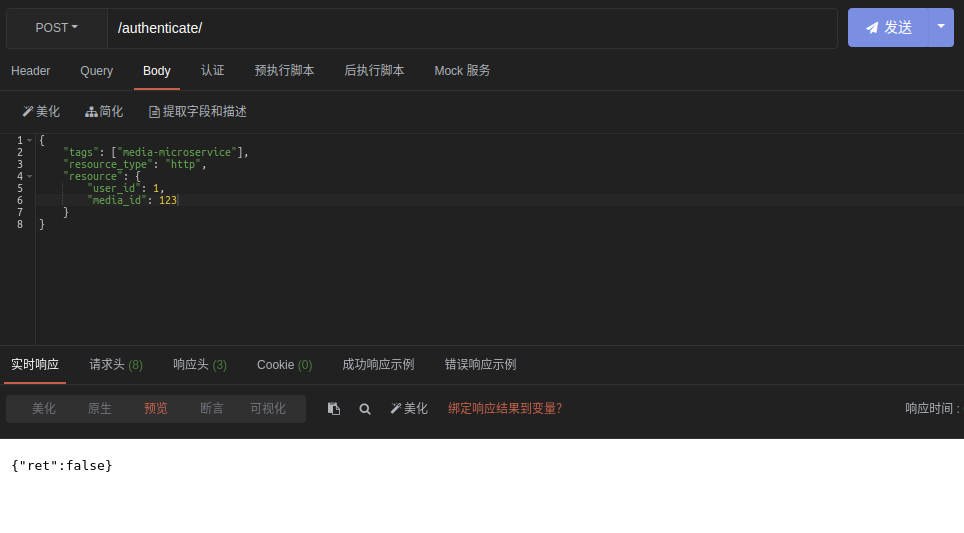

# Sanic ABAC

An attribute based access control server built with sanic.

## Sample

Just one simple sample for testing whether models are valid.

### Rules for samples

Only <user: 1> can download <media: 2>

### Snapshots of results

#### Correct input

`<user:1>` wants to download `<media:2>`

#### Incorrect input

`<user:1>` wants to download `<media:123>`

## Deploy

## Usage

## Roadmap

- [ ] More protocols support
- [ ] APIs for CRUD
- [ ] Unit test
- [ ] Dynamic code loading using Pycode_Object
- [ ] More flexible structure of rules.